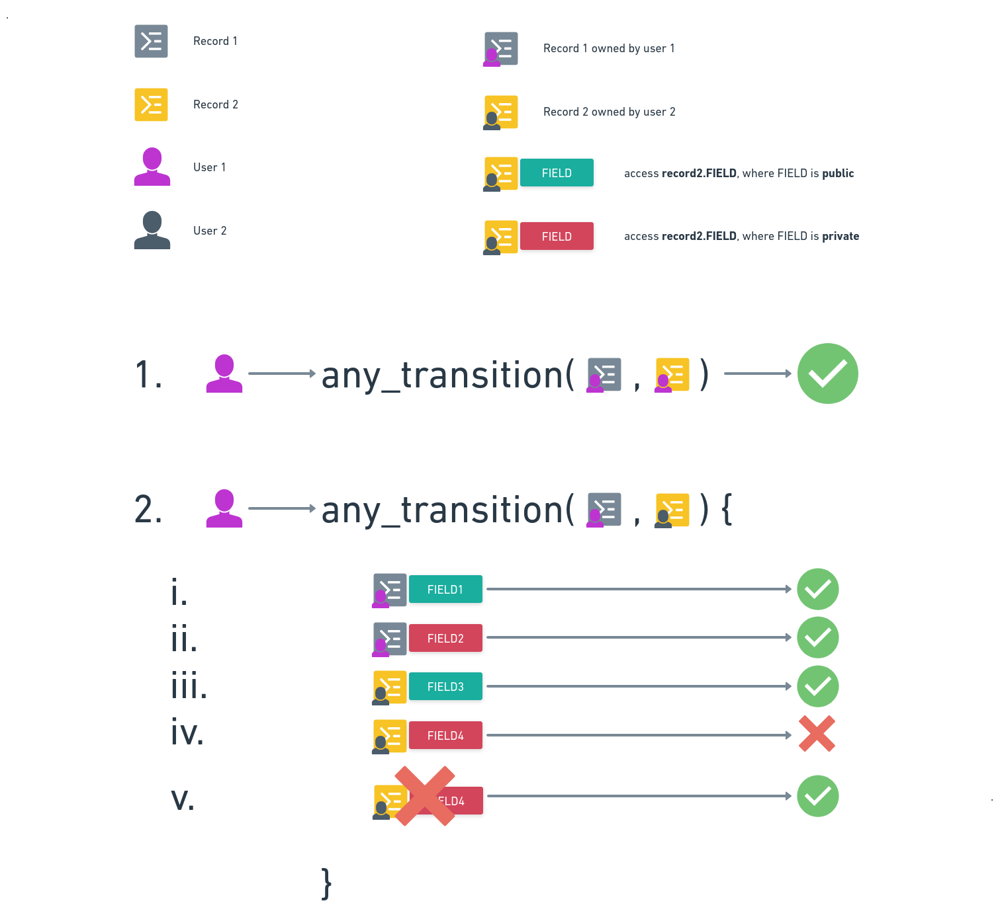
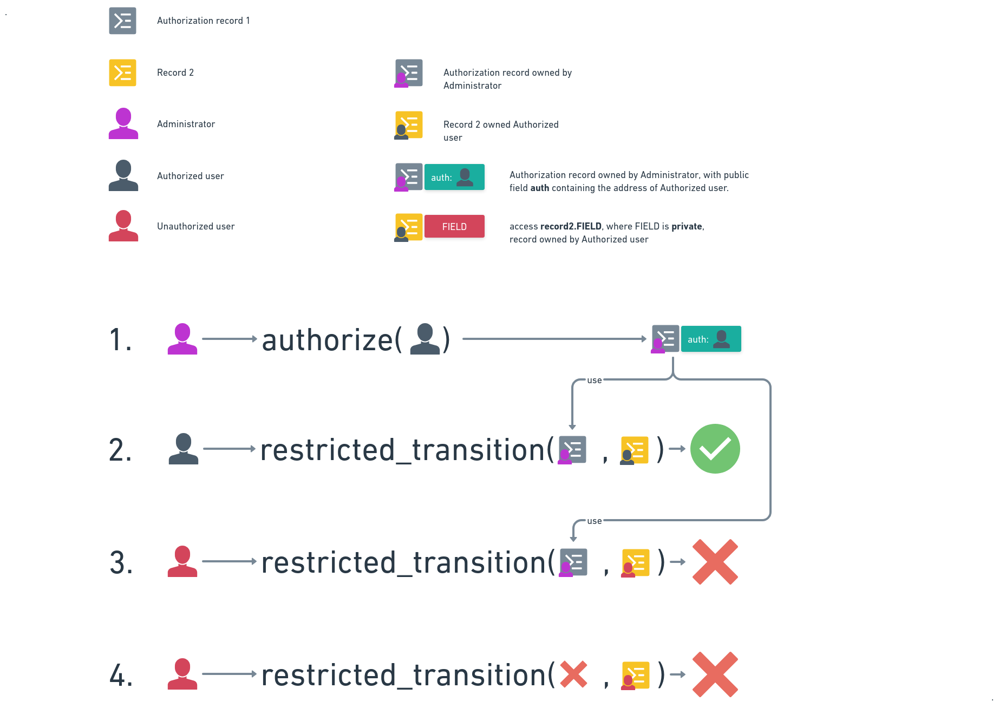
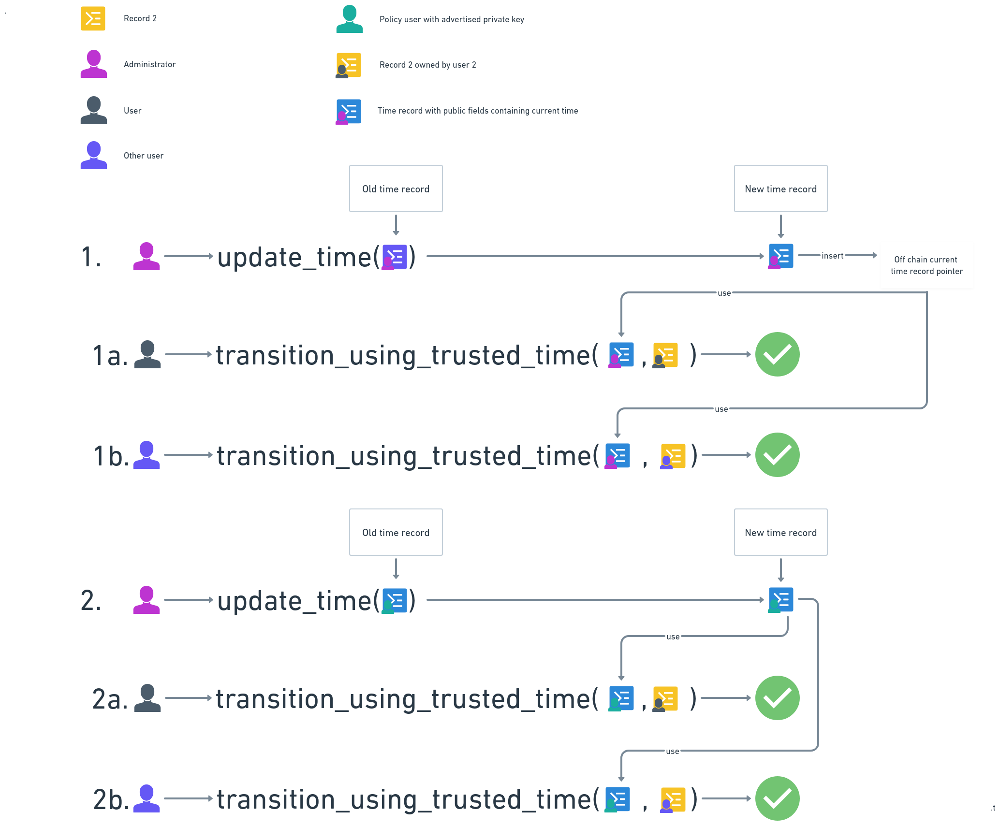

## 1. Abstract

Aleo is a L1 blockchain using ZK proofs. This feature enables significant scalability as contracts are run by one, and verified by many in O(1) time. This is opposed to legacy protocols where validators run code again to verify. There is a caveat though, whatever is executed in the `finalize()` function uses a one-time execution and a many-time execution model. This means it is only as scalable as legacy protocols. Aleo's record infrastructure is scalable. SnarkVM needs one new minor (?) feature to avoid `finalize()` function: in transitions, make it possible to access the public fields of records whose owner differs from the signer. In other words, we need “owned by one and used by many" types of records for transitions.

This new feature has several applications, including but not limited to:
1. **Authorization** 
    1. User can be authorized to use some transitions by Administrator. This can be done by the Administrator creating an Authorization record with the user's address in the public field. User can use this record (eventhough it is not owned by him) to access any desired transition.
    2. Records can also be used to authorize programs (by their addresses) to use any desired transitions by issuing Authorization records. Thus making the system more modular, secure, and upgradeable.
2. **Provide system updateable system settings**  
    An authority can create and recreate a record of system settings. These can be used in any transition by anyone. Once the settings are updated only the updated settings will be applicable to the next transition.
3. **Enable or disable system transitions**  
    The existence of a record can prove a transition is enabled or disabled. The Administrator can issue the record.
4. **Provide token prices for the system**  
    A records public field can be the price provided by some Oracle for a token. The record can be updated by Oracle and read by anyone.
5. **Provide UTC time for the system**  
    A record of the current UTC time can be consumed and recreated by a node every `x` minutes and read by anyone as a trusted time record.

## 2. Specification

**Figure 1: Current Transition Logic**  
In **Figure 1** User1 is the transition signer.

As **Figure 1** shows, the current transition logic is:
1. If the transition contains only records owned by the signer, the transition is executed.
2. If any of the input records are not owned by the signer, then the transition is rejected. Even if the record has public fields that otherwise are accessible.

**Figure 2: Proposed Transition Logic**

In **Figure 2** user 1 is the transition signer.
As **Figure 2** shows, the proposed transition logic is:
1. If the transition contains only records owned by the signer, then the transition is executed. As is the case with the current logic.
2. If the input of the transition is a mix of records owned by the signer and not owned by the signer, then:
    1. All the public fields of the signer's records are accessible in the transition. As in current logic.
    2. All the private fields of the signer's records are accessible in the transition. As in current logic.
    3. All the public fields of the record not owned by the signer are accessible in the transition. **DIFFERENT from current logic!**
    4. Accessing any private fields of the record that are not owned by the signer will result in an error. **DIFFERENT from current logic!**
    5. No access to fields of a record not owned by the signer should be allowed. **DIFFERENT from current logic!**   
    This is needed for allowing the execution of certain transitions. The very existence of the record is the proof of the transition being enabled. The transition must fail if the record is missing.

### 2.1 Use Cases

#### 2.1.1 Authorization Record

**Figure 3: Authorization process**

Authorization can be executed in the following way:
1. The Administrator (contract) creates an authorization record with the authorized address in the public field.
2. The authorized address can access the transition using the authorization record created in (1.) and any other record can be used here that are owned by the authorized user.
3. Unauthorized user can not access the transition, as there is no record that would authorize this user.

#### 2.1.2 System Settings Record

**Figure 4: System Wide Settings Record**

System wide settings can be created in the following way:
1. Administrator (contract) creates a record with the system wide settings in the public field.
2. Any transition can access the system wide settings by reading the public field of the system settings record. (User 1 can use it).
3. Any transition can access the system wide settings by reading the public field of the systems settings record. (User 2 can use it as well).
4. System wide settings can be changed by administrator (contract) by consuming the record and creating another one.

#### 2.1.3 Provide trusted time with `Time Record`

In their public field, time records contain the current UTC time available to all users and contracts. This is an effective mechanism because the `block.height` representation is supported only in the `finalize()` functions currently. If trusted time is available for UTXO logic, we can have a scalable time representation.

Time records can be created in the same way as the system-wide settings record. The only difference is that the record can be consumed and recreated by the administrator every `x` minute/block. The record can be used by any transition to get the current UTC/local time. As time record can only be updated by a trusted party many can read it and use it in transitions in other contracts as well.

**Figure 5: Provide trusted time as record**

There are two ways to implement it:
1. Administrator (contract) creates a record with the current time in the public field, but the administrator is the owner of the record. This way, administrators must provide off-chain access to the record to other contracts, because they can not access the record directly.
2. Administrator (contract) creates a record with the current time in the public field, but the record is owned by a policy account whose private key is known by everyone. This way all users can access the record directly by searching for it on the blockchain.

#### 2.1.4 Oracles provide Price Record of real world assets

The public field of price records works exactly the same way as time records, since only price is substituted for time.

## 3. Attempted Workarounds

To make the above possible with current system we need to find a workaround. We have failed to do so, though it is possible that we have missed something. 

The records we want to create must have the following properties:
1. **Create by one** - They must be created by one single authority (voting contract, administrator contract, single administrator). And their consumption must be controlled by the same entity. 
2. **Read by all** - None, some or all of the fields of the record must be publicly readable. 
    1. Where none of the fields of the record are readable, the presence of the record means authorization was given to use a transition.  
    2. Where some or all the fields of the records are publicly readable, the record can be used to store data that is readable by all transitions.
3. **Revoke by one** - The record can be consumed at any time by the authority. If there was a copy of the record with the same credentials, they must be revoked as well. This means that the availability of the records and their public fields are controlled by the authority.

In any workaround attempt the above three points must hold.

**Figure 6: Attempting Workarounds**

**Figure 6** displays the two basic workaround classes. It displays the simplest cases: there is a `Time Record` that should be read by all, and a `Record 2` that is the input to a transition. User 1 executes the transition. There are two strategies to unify the owners of two different records:
1. Change the owner of the `Record2` of User to policy address.
2. Change the owner of the `Time Record` to user's address.

### 3.1 Change the owner of the `Record2` of User to policy address

This workaround attempts to unify record owners is done by changing the owner of the Users record to Policy Address **Figure 6/1**:
1. Administrator updates time and assigns policy address to `owner`.  
1a. Change the owner of the `Record 2` of User to policy address.  
1b. Execute `transition_using_trusted_time()` using the `Time Record` and `Record 2`.
The problem with this method is that even the private fields of `Record 2` are accessible by anyone as Policy Address is the owner of the record. This is unacceptable in most cases. There is nothing to be done about that. Unfortunately all the arguments of `transition_using_trusted_time()` will be accessible by anyone as well, as the policy address is the signer of the transition.

### 3.2 Change the `Time Record` owner to policy address

This workaround attempt is done by changing the `Time Record` owner to Policy Address Figure 6/2:  
2. Administrator updates time and assigns policy address to `owner`.  
2a. Change the time record owner to the User's address.  
2b. Execute `transition_using_trusted_time()` using the 2a `Time Record` and `Record 2`.  
2c. Administrator updates time.

The problem with this method is that: `Time Record` resulting from (2c.) is different from the `Time Record` resulting from 2a. 
1. There is no guarantee that the user will not use `Time Record` from 2a later than when `Time Record` is already updated. This can not be prevented. 
2. Theoretically in (2a.) the `Record 2` could be also added as argument of `change_owner_of_time_record()` and only allow `Time Record` to be consumed with `Record 2`. But there are two issues with this solution:
    1. Currently, it cannot be guaranteed that User will use the `Time Record` from (2a.) before `Time Record` is updated.
    2. If both `Time Record` and `Record 2` use the same policy address, `Record 2`'s private fields will be accessible by anyone. This is unacceptable in most cases.

<!-- Define key terminology here. -->

<!-- Describe the architecture. -->

<!-- Include process diagrams. -->

### Test Cases

There is no test cases for this ARC. 

<!-- Provide any test vectors that should be included in unit and/or integration tests. -->

<!-- Are there edge cases to be aware of? -->

<!-- Include test code snippets, if possible. ->

## Reference Implementations

This section should contain links to reference implementations that the community can review to evaluate the
quality, complexity, and completeness of the new ARC standard.

<!-- Link to any relevant Github issues. -->

<!-- Link to any related Github branches and/or pull requests. -->

## Dependencies

Any complex protocol that wants to apply:
1. Complex authorization logic.
2. System wide settings.
3. Trusted time over the record logic without using `finalize()`.
4. Trusted price over the record logic without using `finalize()`.
5. Expandable and upgradable system.

<!-- Will this affect the Aleo PM, Aleo Explorer, or Aleo Studio? -->

<!-- Will this affect Aleo, Leo, snarkOS, snarkVM, or any other repositories? -->

### Backwards Compatibility

This ARC is backwards compatible with the current system. It does not change the current logic in any way. It only adds a new feature to the system.

<!-- List all backwards incompatibilities and their severity. -->

<!-- How will the backwards incompatibilities be resolved? -->

## Security & Compliance

This ARC provides additional security features to Aleo's record logic. It does not introduce any new security risks.

<!-- Outline any potential security concerns. -->

<!-- Does this proposal introduce regulatory risk? -->

## References

No references provided.

<!-- List any links that would be helpful for context. -->

